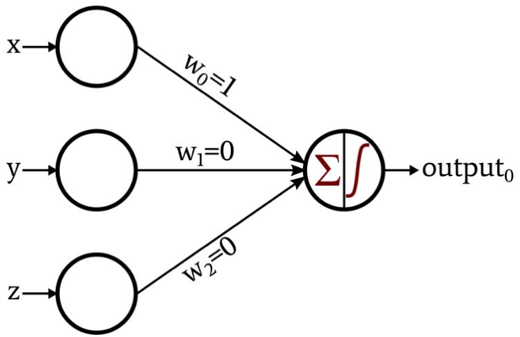
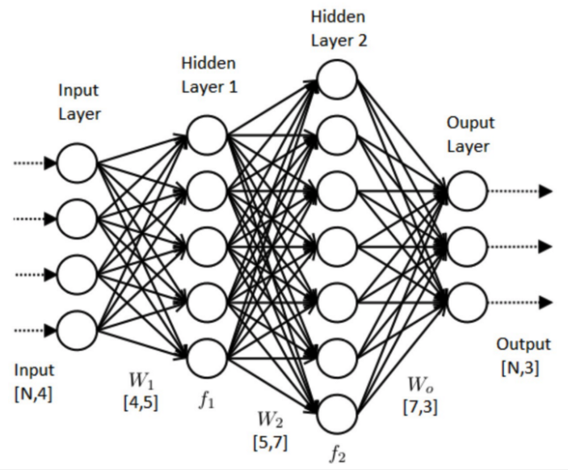
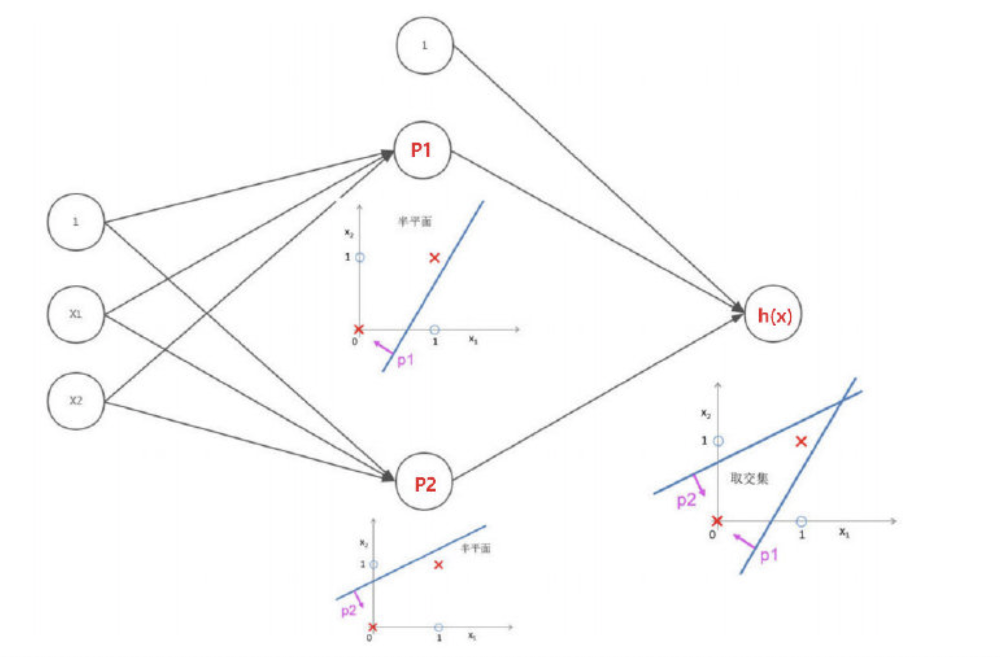
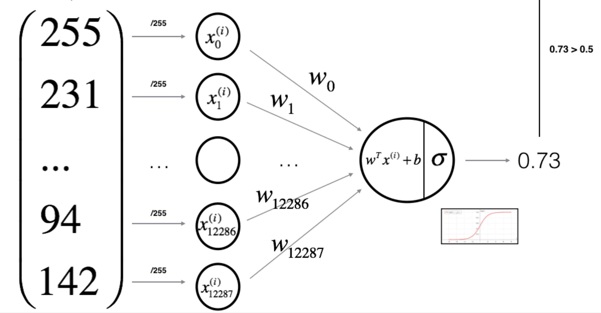
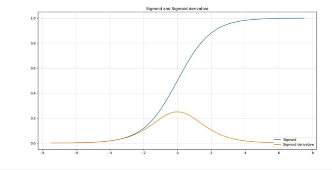
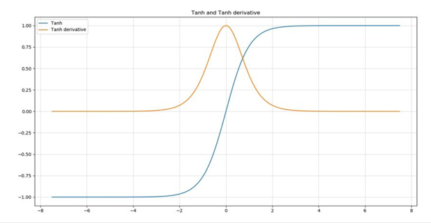
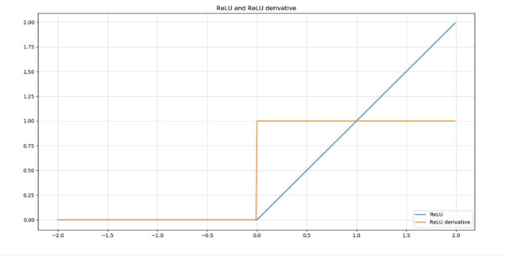
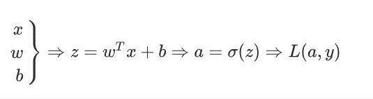
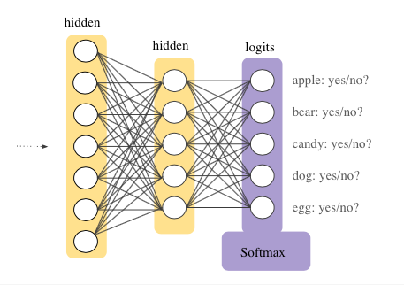
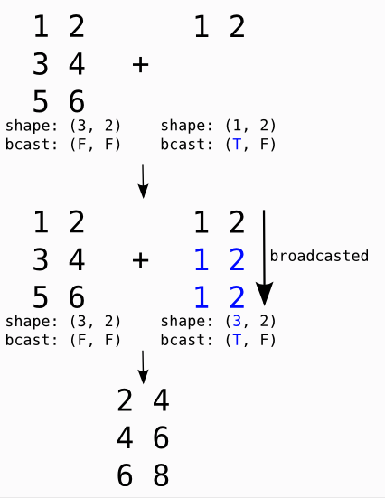

## Contents

- [1. Neural Network Definition](#1-Neural-Network-Definition)
- [2. Neural Network Elements](#2-Neural-Network-Elements)
   - [2.1 Perceptron](#21-Perceptron)
   - [2.2 Neural Network Structure](#22-Neural-Network-Structure)
   - [2.3 Neural Network in Non-Linear data](#33-Neural-Network-in-Non-Linear-data)
- [3. Learning algorithm](#3-Learning-algorithm)
  - [3.1 General Architecture](#31-General-Architecture)
  - [3.2 Initialise Parameter](#32-Initialise-Parameter)
  - [3.3 Activation Function](#33-Activation-Function)
  - [3.4 Forward Propagation](#34-Forward-Propagation)
  - [3.5 Backward Propagation](#35-Backward-Propagation)
  - [3.6 Gradient Descent](#36-Gradient-Descent)
- [4. Softmax](#4-Softmax)
- [5. Vectorization and Broadcasting](#5-Vectorization-and-Broadcasting)
- [6. Reference](#6-Reference)

## 1. Neural Network Definition
Neural network is a type of machine learning algorithm which models itself as the human brain. it is designed to recognise pattens by a set of algorithms.

**Application**
- Clustering
     - Search
     - Anomaly detection
- Classification
     - Detect faces, identify people in images, recognize facial expressions (angry, joyful)
     - Identify objects in images (stop signs, pedestrians, lane markers…)
     - Recognize gestures in video
     - Detect voices, identify speakers, transcribe speech to text, recognize sentiment in voices
     - Classify text as spam (in emails), or fraudulent (in insurance claims)
     - Recognize sentiment in text (customer feedback)
- Predictive Analytics(Regressions)
     - Hardware breakdowns (data centers, manufacturing, transport)
     - Health breakdowns (strokes, heart attacks based on vital stats and data from wearables)
     - Customer churn (predicting the likelihood that a customer will leave, based on web activity and metadata)
     - Employee turnover (ditto, but for employees)

## 2. Neural Network Elements
### 2.1 Perceptron
A perceptron is a linear classifier, like sigmond function, it classifies input by separating two categories with a straight line. We will get a simple neural network if we add hidden layer between input and output.

=\frac{1}{1+e^{-z}})

 

### 2.2 Neural Network Structure
Neural neworks are typically organized in layers, input layer, hidden layer and output layer. Layers are made up of a number of interconnected 'nodes' which contain an 'activation function'. Patterns are presented to the network via the 'input layer', which communicates to one or more 'hidden layers' where the actual processing is done via a system of weighted 'connections'. The hidden layers then link to an 'output layer' where the answer is output as shown in the graphic below.

 

- Depth: from hidden layer to output layer, 3 in above example
- Feature hierarchy:

In deep-learning networks, each layer of nodes trains on a distinct set of features based on the previous layer’s output. The further you advance into the neural net, the more complex the features your nodes can recognize, since they aggregate and recombine features from the previous layer.

- Neural network with multiple hidden layers is much more effective than neural network with single hidden layer
- If the number of hidden layers or neurons in hidden layers is increased, the "capacity" of the neural network will be enlarged and the spatial expression will be stronger.
- With too many hidden layers or neurons in hidden layers, it is easy to overfit
- **Regulisation or drop out** to avoid overfitting

### 2.3 Neural Network in Non-Linear data
To classify the point in plot below, it is impossible to separate them linearly. If we introduce a two layer neural network with 1 hidden layer, 2 neurons in the hidden layer. one neuron generate a line such that points above the line is in red class and another neuron give a new such that points below this line is in red class, and in the output layer, we combine two outputs from hidden layer in outputs, as presented below.

 

## 3. Learning algorithm
### 3.1 General Architecture
Logistical regression a simple neural network with sigmond function, it has two steps
Step 1: Take the input, generate a linear combination of each feature with corresponding initialised weights
Step 2: Apply a sigmod function with output from above

 

### 3.2 Initialise Parameter
1. Initializing all parameters to zero
Not good as symmetry between all neurons will leads to all neurons have the same update on every iteration. All the neurons would still get the same update and no learning would happen.

2. Initializing parameters with random values from a distribution, e.g.Normal. Random initialization is better but may take long time to converge and achieve a significantly low value as weights is taking value from -1 to 1, which can cause gradient vanishing.

3. He initialization: Take randomly generated weights and multiplies them by 2/fan-in and is recommended for ReLU activations.

4. Xavier initialization: Each randomly generated weight is multiplied by variance 2/(fan-in + fan-out)

### 3.3 Activation Function
**Sigmoid**: It’s recommended to be used only on the output layer so that we can easily interpret the output as probabilities since it has restricted output between 0 and 1. One of the main disadvantages for using sigmoid function on hidden layers is that the gradient is very close to zero over a large portion of its domain which makes it slow and harder for the learning algorithm to learn.

=\frac{1}{1+e^{-z}})

^{'}=\frac{d}{dz}g(z)=\alpha(1-\alpha))

 

**tanh**: It’s superior to sigmoid function in which the mean of its output is very close to zero, which in other words center the output of the activation units around zero and make the range of values very small which means faster to learn. The disadvantage that it shares with sigmoid function is that the gradient is very small on good portion of the domain.

=tanh(z)=\frac{e^{z}-e^{-z}}{e^{z}+e^{-z}})

^{'}=\frac{d}{dz}g(z)=1-\alpha^{2})

 

One disadvantage for both sigmond and tanh is that when z is very small or large, the derivatives descent will get very small and close to 0, lower the speed of Gradient Descent

**ReLU**: The models that are close to linear are easy to optimize. Since ReLU shares a lot of the properties of linear functions, it tends to work well on most of the problems. The only issue is that the derivative is not defined at z = 0, which we can overcome by assigning the derivative to 0 at z = 0. However, this means that for z ≤ 0 the gradient is zero and again can’t learn.

)

0\\undefined&\text{ if }z=0 \end{cases}" /></a>

 

**Leaky ReLu** : g(z) = max{α*z, z}. It overcomes the zero gradient issue from ReLU and assigns α which is a small value for z ≤ 0.

### 3.4 Forward Propagation
Given its inputs x from previous layer, each unit computes affine transformation $z = W^{T}x + b $ and then apply an activation function g(z) such as ReLU element-wise. Afterward, we calculate the cost function (loss function - how bad the model perform) to learn our parameters, e.g. Cross-entropy cost. During the process, we’ll store (cache) all variables computed and used on each layer to be used in back-propagation.

 

### 3.5 Backward Propagation
Back-propagtion allows the information go back from cost function backward through the network in order to compute the gradient, so that we can minimise the cost function after the iteration on model's paraeters.

Take one example }) in sigmoid function:

}=w^{T}x^{(i)}+b)

}=a^{(i)}=sigmoid(z^{(i)}))

},y^{(i)})=-y^{(i)}\log(a^{(i)})-(1-y^{(i)})\log(1-a^{(i)}))

The cost is then computed by summing over all training examples:

},y^{(i)}))

Backward Formulas:

</a>

</a>

### 3.6 Gradient Descent
Gradient descent is a first-order iterative optimization algorithm for finding the minimum of a function. It allows the model to update the parameters by opposite direction of the gradient (first derivative ). As the model iterates, it gradually converges towards a minimum where further tweaks to the parameters produce little or zero changes in the loss — also referred to as convergence.

</a></a>

</a>

- Batch: all the training data is taken into consideration to take a single step. We take the average of the gradients of all the training examples and then use that mean gradient to update our parameters. It converges directly to minima

- Stochastic Gradient Descent: take one training sample every time, faster for larger datasets but don't take the advantage of Vectorization

- Mini batch: take a batch of training sample every time

Other optimisation methods
- Gradient descent with momentum
- Exponentially weighted averages
- RMSprop
- Adam optimization algorithm

## 4. Softmax
The softmax function is a function that turns a vector of K real values into a vector of K real values that sum to 1. The sigmoid function is a special case of the softmax function for a classifier with only two input classes.

 

**Formula**

=\frac{exp(o_i)}{\sum_{i=1}^{n}exp(o_i)})

**Cross-Entropy Loss**

},\widehat{y}^{(i)})=-\sum_{j=1}^{q}y_{j}^{(i)}log\widehat{y}_{j}^{(i)}=-log\widehat{y}_{y^{(i)}}^{(i)})

## 5. Vectorization and Broadcasting
Vectorization is the process of converting an algorithm from operating on a single value at a time (for loop) to operating on a set of values (vector) at one time.

Broadcasting is the methodology to perform arithmetic operations on arrays with differing dimensions. General arithmetic operations such as addition, multiplication, subtraction, etc. tend to broadcast arrays before performing the operations on arrays with variations in size. logical presented below -

 

## 6. Reference
[1]: [Deep Learning Specialization](https://www.coursera.org/specializations/deep-learning)

[2]:[Initializing neural networks](https://www.deeplearning.ai/ai-notes/initialization/)

[3]:[Forward Propagation and Backpropagtion](https://towardsdatascience.com/coding-neural-network-forward-propagation-and-backpropagtion-ccf8cf369f76)
