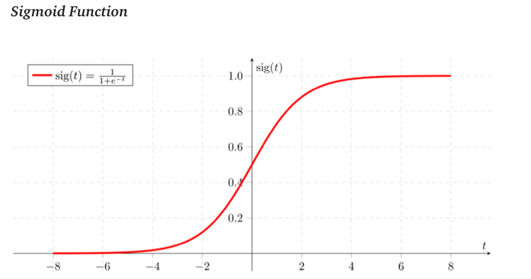

------
## Contents

- [1. Logistic Regression](#1-Logistic-Regression)
- [2. Cost Function](#2-Cost-Function)
   - [2.1 Gradient Descent](##21-Gradient-Descent)
   - [2.2 Other Optimization Method](##22-Other-Optimization-Method)
- [3. Regularization](#3-Regularization)
- [4. Multiclass classification problems](#4-Multiclass-Classification-Problems)
- [5. Implementation](#5-Implementation)

## 1. Logistic Regression
A statistical model to fit the probability of a certain class or event existing to determine what class a new input should fall into, such as binary results - pass or fail in the exam, with more complex extension usage.

**Classification Probelms**
- Credit Risk
- Click through rate
- Medical treatment
...

**Basic Information**
- Actual event (Dependent variables Y) is a discrete value, with two possible values, 0/1 (multiple class in extended situation)
- The logit function of predicted probability of actual event $\hat{Y}$ is a linear combination of independent variables (X)
- Decide the cut-off (decision boundary) on $\hat{Y}$ to predict/fit the actual class $Y$ with the help of some metrics (Confustion metrics, AUC-ROC plot, F1-score, accuracy, GINI)

**Model**

</a>

</a>

where  is the parameter (or weight) of each independent variables

 is *sigmond function (logistic function)* with S shape

## 2. Cost Function
</a>

- If , cost function is .
- If , cost function is 

</a>

- If hypothesis predicts exactly correct then that cost corresponds to 0
- otherwise, cost goes to infinity and penalize the learning algorithm with a massive cost

### 2.1 Gradient Descent

Partial derivative of cost function:

</a>

</a>

Repeat until convergence:
</a>

Add  if we have regularization on parameters for 

### 2.2 Other Optimization Method
- Conjugate gradient
- BFGS (Broyden-Fletcher-Goldfarb-Shanno)
- L-BFGS (Limited memory - BFGS)

## 3. Regularization

To solve the problem of overfitting (high variance), which is good performance in training sample but bad results on testing sample, we can reduce number of features or apply Regularization.

With regularization:
- Keep all features, but reduce magnitude of parameters θ (magnitude might be 0 depends on regularization method)
- Works well when we have a lot of features, each of which contributes a bit to predicting y

</a>

Gradient descent optimization with regularization ,

</a>

</a>

## 4. Multiclass classification problems

One vs. all classification - Suppose we have three classes instead of binary value, we split the training set into three separate binary classification problems:
- Class 1 vs class 2 and 3 - 
- Class 2 vs class 1 and 3 - 
- Class 3 vs class 1 and 2 - 

## 5. Implementation
[Logistic Regression implementation]()
