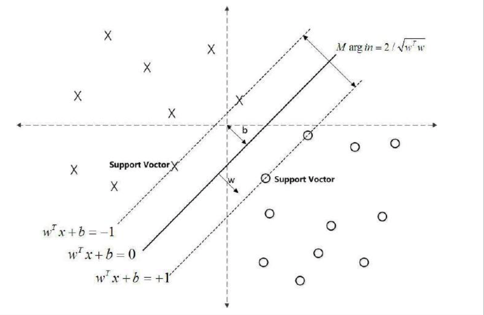
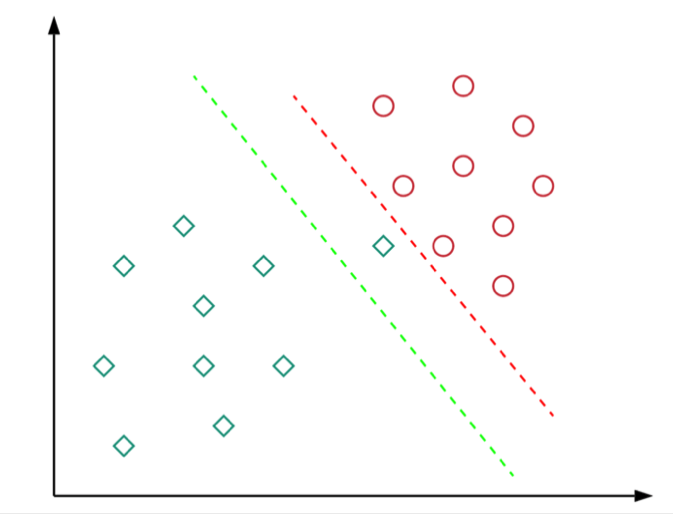
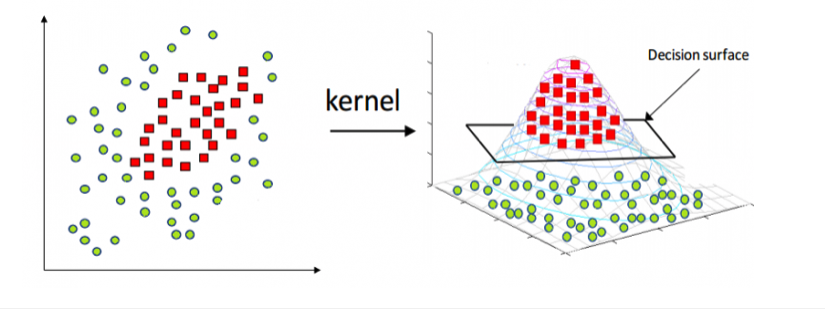

------
## Contents

- [1. What is SVM](#1-What-is-SVM)
- [2. SVM with Hard Margin ](#2-SVM-with-Hard-Margin)
- [3. SVM with Soft Margin ](#3-SVM-with-Soft-Margin)
- [4. Kernel Trick for Non Linear SVM](#4-Kernel-Trick-for-Non-Linear-SVM)
- [5. Summary](#5-Summary)
- [6. Implementation](#6-Implementation)
- [7. Reference](#-Reference)

## 1. What is SVM
Support vector machines (SVMs) are a set of supervised learning methods used for classification, regression and outliers detection. For classification problem, SVM algorithm fit a hyperplane that distinctly classifies the data points with maximum margin, i.e the maximum distance between data points of both classes.

**Terminologies**
Take an example of 2D dimensions:

</a>

- Hyperplane: a function  used to differentiate between features (Red line)
- Support vector points: The points on two dashed lines, which are closest to the hyperplane  or 
- Margins: Two times of the distance of the Support vector points from the hyperplane
- Decision function: 

**SVMs model**
- Linear SVM (Hard margin): The data is linearly separable
- Linear SVM (Soft margin): Extension of hard margin SVM, the data is almost linearly separable  
- Non Linear SVM: Apply kernel function to map data points to different feature space so that data points are linearly separable

## 2. SVM with Hard Margin

In this section, I will give detail process of fit hyperplane for linearly separable data.

**Optimize function**
- The distance between two parallel lines  and  is 2
- The distance from points to the hyperplane:  where 
- Support vectors with the minimal distance to hyperplane satisfy the equation 

① To maximal margin,

</a>

</a>

</a>

This is a quadratic programming - minimising a quadratic function subject to linear constraints.

② **Lagrange multipliers**
To solve above equation, construct a Lagrange function,   is Lagrange multiplier

- **Lagrange duality principle**：
   - Optimization problems may be viewed as primal (in this case minimising over w and b) or dual (in this case, maximising over a).
   - For a convex optimisation problem, the primal and dual have the same optimum solution.

- So the optimisation can be converted as:

</a>

- Taking partial derivatives with respect to w and b we obtain:

- Substitute into :

</a>

- Transfer the problem from max to min：

We now have an optimisation problem over (Apply Sequential Minimal Optimization, SMO to solve it). After optimising our Lagrange multipliers, , we can have optimised value of  and  so that to classify new data points

## 3. SVM with Soft Margin

Soft Margin allow SVM to make a certain number of mistakes and keep margin as wide as possible so that other points can still be classified correctly.

In the plot below, even the red line can separable the points perfectly, but the green decision boundary has a wider margin that would allow it to generalize well on unseen data. In that sense, soft margin formulation would also help in avoiding the overfitting problem.

Data points that are far away on the wrong side of the decision boundary should have more penalty as compared to the ones that are closer, so the penalty on non-perfectly classified points is **Hinge Loss**:

In mathematics, the objective function becomes:

where C is a hyperparameter that decides the trade-off between maximizing the margin and minimizing the mistakes.
    - When C is small, classification mistakes are given less importance and focus is more on maximizing the margin
    - when C is large, the focus is more on avoiding misclassification at the expense of keeping the margin small

We introduce soft margin as , objective function becomes

Similar process as hard margin, we construct a **Lagrange multipliers**  and take the property of Lagrange duality  
- Taking partial derivatives with respect to w, w and , set it to 0
- Taking partial derivatives with respect to , apply SMO to optimise it

The Lagrange dual representation of optimised function is:

## 4. Kernel Trick for Non Linear SVM

When data is not linearly separable, as plots presented below, we apply Kernel trick so that it can be separable.

Kernel functions are generalized functions that take two vectors (of any dimension) as input and output a score that denotes how similar the input vectors are.

The Lagrange dual representation  of optimised function is:

"/>

## 5. Summary
Pros:
- Effective in the higher dimension, especially when the number of features are more than training examples.
- Suitable for both lieanr and non-linear problems
- The hyperplane is affected by only the support vectors thus outliers have less impact.
- SVM is suited for extreme case binary classification.

Cons:
- For larger dataset, it requires a large amount of time to process.
- Does not perform well in case of overlapped classes.

How to choose kernel function?

## 6. Implementation
[SVM Implementation]()

-----
## 7. Reference

[1] :[Support Vector Notes by Andrew Ng](http://cs229.stanford.edu/notes/cs229-notes3.pdf)

[2] :[Scikit-Learn SVM](https://scikit-learn.org/stable/modules/svm.html)

[3] :[Wikipedia SVN](https://en.wikipedia.org/wiki/Support_vector_machine)

[4] :[Implement SVM with Python ](http://blog.csdn.net/wds2006sdo/article/details/53156589)
