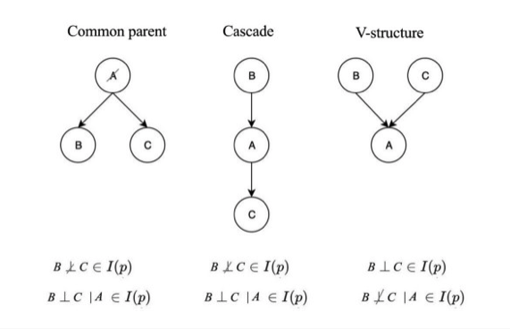
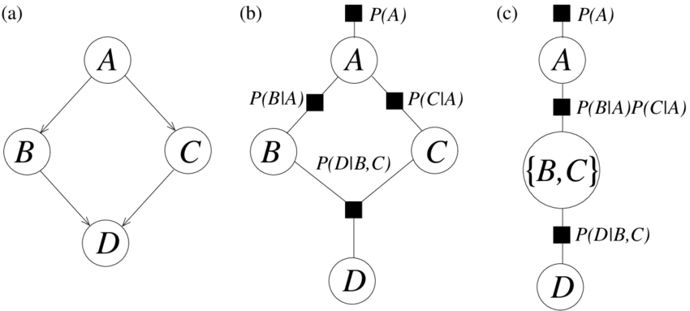

## Contents

- [1. Frequentist Inference and Bayesian Inference](#1-Frequentist-Inference-and-Bayesian-Inference)
- [2. Bayes Theorem](#2-Bayes-Theorem)
- [3. Bayesian Network](#3-Bayesian-Network)
- [4. Convert Bayesian Network to Factor Graph](4-Convert-Bayesian-Network-to-Factor-Graph)
- [5. Naive Bayes](6-Naive-Bayes)
- [6. Implementation](7-Implementation)
- [7. Reference](8-Reference)

## 1. Frequentist Inference and Bayesian Inference
Traditionaly, we tend to draws conclusions from sample data by emphasizing the frequency or proportion of the data, which is frequentist inference. It has rigid framework to learn basic statistics, like p-value, confidence interval, hypothesis testing.

The Bayesian Inference is an alternative way of statistical inference, it allows the unknown parameters to be associated with probabilities. General process:
- Before collecting any data we assume that there is uncertainty about the value of a parameter. This uncertainty can be formalised by specifying a pdf or pmf for the parameter (**Prior Beliefs**).
- Conduct an experiment to collect some data that will give us information about the parameter (**Likelihood**).
- Use Bayes Theorem to combine our prior beliefs with the data to derive an updated estimate of our uncertainty about the parameter(**Posterior Probability**).

Main differences:

- The Frequentist Inference on unknown parameters is often a fixed value based on the sample from a significance test or a conclusion in the form that a given sample-derived confidence interval. The sample is random, so Frequentist Inference focus more on sample spaces and their distribution.

- In Bayesian Inference, the unknown parameters is a random variables with a probability distribution. The Bayesian approach allows these probabilities to have an interpretation as representing the scientist's belief that given values of the parameter are true. Given the results of the experiment or study, Bayes approach conclude a probability distribution with known parameters.  

## 2. Bayes Theorem
Conditional probability (posterior probability), is the probability of an event with the prior knowledge of another related event has already happen.

</a>

where  is the joint probability, which can be represented as P(A, B).

## 3. Bayesian Network
A Bayesian network represents random variables and their dependencies using a directed acyclic graph (DAG). DAG is a directed graph with no directed cycles. Variables can be positively dependent, negatively dependent or unrelated.

**Three types of dependencies in Bayesian Network**

The node represents a variable, they can be observational information, hidden information or unknown information. If two nodes are linked, it indicates that one node (parent node) directly influences the other (children node). The is a conditional probability in the link - P(the probability of children node given it's parent node happen).

For example, in the plot of dependencies showed above,

**Cascade**
- If A is observed, B and C are blocked by A and independent from each other. we have 

- If A is not observed, X and Y are not independent. we have probability distribution for a)  

**Common Parent**
- If A is observed, B and C are independent, we have 
-If A is not observed, 

**V-Structure**
-  If A is observed, B and C are not independent. For example, a pedestrian is hurt (event A) if either the car or the pedestrian runs a red light. By knowing a pedestrian is hurt, we know the pedestrian is following the rule if we know the car runs a red light. Therefore B and C are not independent given A.
- If A is not observed, knowing B gives us no information on C.

To summarize, Bayesian networks represent probability distributions of all random variables that can be formed via products of smaller, local conditional probability distributions (one for each variable):

</a>

## 4. Convert Bayesian Network to Factor Graph
A factor graph is a bipartite graph representing the factorization of a function, enabling efficient computations, such as the computation of marginal distributions through the sum-product algorithm.

(a) A Bayesian network. (b) The corresponding cyclic factor graph. (c) The singly-connected factor graph created by combining the variables B and C into a two-variable cluster corresponding to a new compound variable.

## 5. Naive Bayes
Navies Bayes is the simplest Bayesian Network with no dependency between variables.

Pros:
- It is easy and fast to predict class of test data set. It also performs well in multi class prediction
- When assumption of independence holds, a Naive Bayes classifier performs better compare to other models like logistic regression and you need less training data.
- It performs well in case of categorical input variables compared to numerical variable(s). For numerical variable, normal distribution is assumed.

Cons:
- If categorical variable has a category (in test data set), which was not observed in training data set, then model will assign a 0 (zero) probability and will be unable to make a prediction. This is often known as “Zero Frequency”. To solve this, we can use the smoothing technique. One of the simplest smoothing techniques is called Laplace estimation.
- Another limitation of Naive Bayes is the assumption of independent predictors. In real life, it is almost impossible that we get a set of predictors which are completely independent.

To Improve:
- If continuous features do not have normal distribution, we should use transformation or different methods to convert it in normal distribution.
- If test data set has zero frequency issue, apply smoothing techniques “Laplace Correction” to predict the class of test data set.
- Remove correlated features, as the highly correlated features are voted twice in the model and it can lead to over inflating importance.

Applications:
- Real time Prediction
- Multi class Prediction
- Text classification/ Spam Filtering/ Sentiment Analysis
- Recommendation System

## 6. Implementation
[Naive Bayes Implementation](https://github.com/AprilHe/ML-Notes/blob/master/MachineLearning/4.%20Probabilistic%20Graphical%20Model/4.1Bayes%20Network/Naive%20Bayes.ipynb)

## 7. Reference
1. [Bayes Server](https://www.bayesserver.com/docs/introduction/bayesian-networks)

2. [A Brief Introduction to Graphical Models and Bayesian Networks](https://www.cs.ubc.ca/~murphyk/Bayes/bayes.html)
