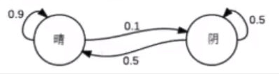
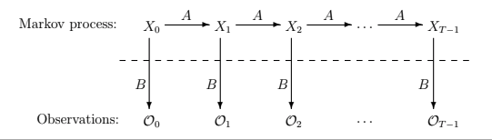
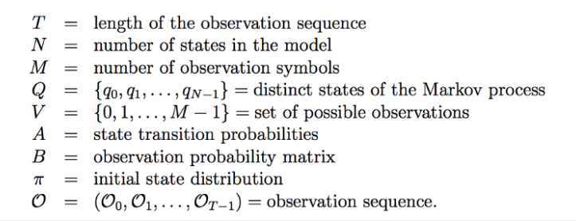
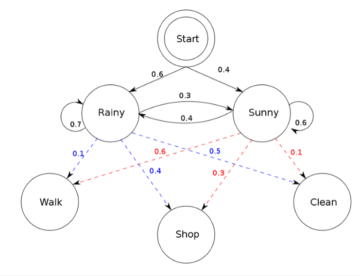
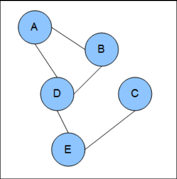

## Contents
- [1. Probabilistic Graphical Model](#1-Probabilistic-Graphical-Model)
- [2. Markov Models](#2-Markov-Models)
   - [2.1 Markov Process](#21-Markov-Process)
   - [2.2 Hidden Markov Models](#22-Hidden-Markov-Models)
- [3. Markov Networks](#3-Markov-Networks)
- [4. Conditional random field](#4-Conditional-Random-Field)
- [5. Implementation](#5-Implementation)
- [6. Reference](#6-Reference)

## 1. Probabilistic Graphical Model
1. A network graph contains multiple nodes to represent random variables and links between nodes to illustrate dependency.  
2. Bayesian network is a directed acyclic graph.
3. Markov model is a graph that describe a sequence of possible events (nodes) in which the probability of each event depends only on the state attained in the previous event.
4. Markov network (Markov random field) is an undirected graph.
5. Conditional random field is a Markov network with some precondition.

## 2. Markov Models
### 2.1 Markov Process
A random process whose future probabilities are determined by its most recent values (memorylessness). Then we have:

=P(X_{n+1}=x|X_n=x_n))

Suppose weather follow the Markov Process:
- If today is sunny, the probability of cloudy tomorrow is 0.1 and keep sunny is 0.9
- It today is cloudy, the probability of cloudy or sunny tomorrow is 0.5.

 

|        | Sunny   | Cloudy   |
| ------ | ---- | ---- |
| **Sunny** | 0.9  | 0,1  |
| **Cloudy** | 0.5  | 0.5  |

The transition matrix is
</a>

### 2.2 Hidden Markov Models
Hidden Markov Model (HMM) is a statistical Markov model where markov process is on unobserved (i.e. hidden) states.

The term hidden refers to the first order Markov process behind the observation. Observation refers to the data we know and can observe.

  &nbsp;

**Terminology**

  &nbsp;

**State transition probabilities** are the arrows pointing to each hidden state. **Observation probability matrix (Emission Probability)** are the arrows pointing to each observations from each hidden state. **Initial state distribution** gets the model going by starting at a hidden state.

 The key problems in HMM:
 1. Given a known model and a sequence observation, what is the likelihood of sequence observation happening?
 2. Given a known model and sequence observation, what is the optimal hidden state sequence?
 3. Given sequence observation and number of hidden states, what is the optimal model which maximizes the probability of observation?

Take an example illustrated in the plot below, markov process is shown by the interaction between “Rainy” and “Sunny” in the below diagram and each of these are **HIDDEN STATES**. OBSERVATIONS are known data and refers to “Walk”, “Shop”, and “Clean” in the above diagram. In machine learning sense, observation is our training data, and the number of hidden states is our hyper parameter for our model.

 &nbsp;

 Three problems in this plot:
 1. Given a known model, we observe three things in three consecutive days, they are walk, shop and clean, what is the probability of these events
 2. Given a known model and observed events, what is weather in these three days?
 3. The most complicated - given the observations on events and number of possible weather, develop a model to have the maximal probability of behaviour happening.

**Solution to problem 1**
- Naive approach: calculate conditional probability of behaviours by multiply the probability of each hidden state and the probability from each hidden state to observations, complexity is .  
- Forward algorithm:
   - With the assumption of behaviour in the first day, calculate the probability in all different weathers
   - With the  assumption of behaviour in the first two days, multiply the value saved in step 1 and the probability of observation in the second day...
   - complexity is
- Backward algorithm:

**Solution to problem 2**

Viterbi Algorithm - Compute the joint probability of the observation sequence together with the best state sequence.

From Bayes Theorem, we have
</a>

For a sequence t = 3 in our example,
</a>

From the property of Markov process: </a>

From the independence:
</a>

So, </a>

To find optimal hidden state sequence, we maximize </a>

In this example:

</a>

</a>

</a>

</a>

</a>

</a>

so, the most likely sequence of hidden state is (Sunny, Sunny, Rainy).

**Solution to problem 3**
Apply EM Algorithm to maximal the likelihood of observation given initial state probability, transition matrix between state and Emission Probability from state to observation.
[Check EM Algorithm-To be updated]()

## 3. Markov Networks
Markov network (Markov random field) is an undirected graph showed below - Each edge represents dependency. In this example: A depends on B and D. B depends on A and D. D depends on A, B, and E. E depends on D and C. C depends on E.

 &nbsp;

## 4. Conditional Random Field
Conditional random fields (CRFs) are a probabilistic framework for labeling and segmenting structured data, such as sequences, trees and lattices. The underlying idea is that of defining a conditional probability distribution over label sequences given a particular observation sequence, rather than a joint distribution over both label and observation sequences. The primary advantage of CRFs over hidden Markov models is that CRFs don’t rely on the independence assumption. CRFs are similar to Logistic Regression, they use the Conditional Probability distribution, but we extend the algorithm by applying Feature functions as our sequential inputs.
(To be updated)

## 5. Implementation
[HMM Implementation]()

## 6. Reference

1. [A Revealing Introduction to Hidden Markov Model](https://drive.google.com/viewerng/viewer?url=https://www.cs.sjsu.edu/~stamp/RUA/HMM.pdf)
2.[Hidden Markov Model](https://medium.com/@kangeugine/hidden-markov-model-7681c22f5b9)
3.[Conditional Random Fields: An Introduction](http://www.inference.org.uk/hmw26/papers/crf_intro.pdf)
4.[Overview of Conditional Random Fields](https://medium.com/ml2vec/overview-of-conditional-random-fields-68a2a20fa541)
