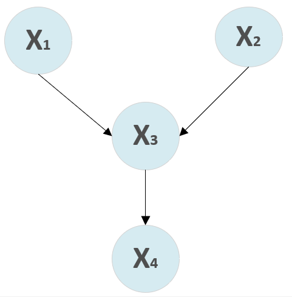
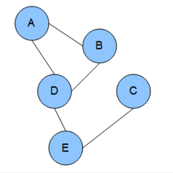

## Contents

- [1. Probabilistic Graphical Model](#1-Probabilistic-Graphical-Model)
- [2. Discriminative Model and Generative Model](#2-Discriminative-Model-and-Generative-Model)

## 1. Probabilistic Graphical Model
Probabilistic graphical model (PGM or GM) is a model contains a graph to illustrate the relations or dependencies(edge) between random variables (node).

The node can be probability distributions of random variables, it has two categories: implicit nodes and observation nodes. The relationship between random variables is displayed as undirected edge and directed edge for dependencies. Based the type of edge, we classify graphical models into two categories — Bayesian networks (directed) and Markov networks (undirected).

GM is commonly used in ML & DL, including Naive Bayes’ algorithm, the Hidden Markov Model, Conditional Random Field, Restricted Boltzmann machine and Neural Networks.

**Bayesian networks**

 

**Markov networks**

 

 ## 2. Discriminative Model and Generative Model
 Bayesian Network is a generative model, which learns the joint probability distribution p(x,y). It predicts the conditional probability with the help of Bayes Theorem. Apart from Bayesian Network, Naive Bayes, HMM and Latent Dirichlet Allocation are all Generative Models

 - Assume some functional form for P(Y), P(X|Y)
 - Estimate parameters of P(X|Y), P(Y) directly from training data
 - Use Bayes rule to calculate P(Y|X)

 A Discriminative model ‌learns the conditional probability distribution p(y|x) directly from training data. Logistic regression, Support Vector Machine, Traditional neural networks, Nearest neighbour, Conditional Random Fields (CRF) are Discriminative models.
