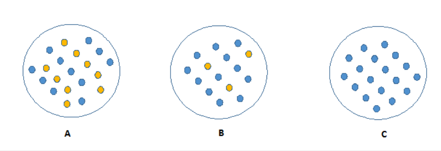
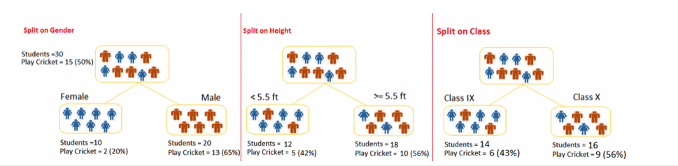

## Contents

- [1. Decision Tree](#1-Decision-Tree)
- [2. Develop a Decision Tree](#2-Develop-a-Decision-Tree)
   - [2.1 Information Gain (ID3)](#21-Information-Gain-(ID3))
   - [2.2 Information Gain Ratio (C4.5)](#22-Information-Gain-Ratio-(C4.5))
   - [2.3 GINI in CART](#23-GINI-in-CART)
- [3. Other Properties](#3-Other-Properties)
- [4. Implementation](#4-Implementation)
- [5. Reference](#5-Reference)

## 1. Decision Tree
Decision tree is a type of supervised learning algorithm  used in classification and regression problems. With a structure like a tree, we split the population or sample into two or more homogeneous sets based on most significant splitter in input variables. Unlike logistic regression which take all significant variables to learn the model, a decision tree is a combination with multiple decision rules using if-else to split samples.

Take an example of whether to play tennis or not, we collected records and generate a decision tree.

  &nbsp;

**Terminology:**
- Root Node: Entire population or sample
- Splitting: The process of divide a node into two or more sub-nodes.
- Decision Node: A sub-node which split further
- Leaf Node: Nodes do not split

## 2. Develop a Decision Tree
Decision trees use multiple algorithms to decide to split a node in two or more sub-nodes. The creation of sub-nodes increases the homogeneity of resultant sub-nodes. The purity of the node increases with respect to the target variable, while entropy decrease. Look at image below, C has the highest purity and it is easy to describe with all information same - lowest information entropy.

 &nbsp;

 Therefore, decision tree splits the nodes on all available variables and then selects the split which results in highest purity and lowest entropy. There are some commonly used algorithm to decide the split, which will be explained in the following sections with example below. In this example, we want to separate the students based on target variable ( playing cricket or not ) from three features, Gender (Boy/ Girl), Class( IX/ X) and Height (5 to 6 ft).

  &nbsp;

### 2.1 Information Gain (ID3)

Suppose we split our sample by a discrete feature with V category, after splitting, the entropy of one sub-group is:

</a>

 where Dv is the number of sample at group v, Dvk is the number of target value at group v.

 The Information Gain of split by feature a is:

</a>

In our example, suppose we split by gender.

- Before splitting, entropy H(D) is :
</a>

- After splitting, the group of female has entropy:
</a>

- After splitting, the group of male has entropy:
</a>

- Weighted entropy of sub-nodes: </a>

- Information Gain: </a>

Same calculation process as above, the Information Gain of height and class are both 0.01, so the tree will split on Gender. The disadvantage for information gain is that it might choose the feature with more categories as they are more likely to have higher information. so we introduce a new criterion - Information Gain Ratio C4.5.

### 2.2 Information Gain Ratio (C4.5)
As the information gain criterion has a preference for features with a large number of categories. In order to reduce this preference, the information gain ratio was introduced to select the optimal partition feature:

</a>

where </a>

IV(a) is larger in general if the number of possible values for feature A is greater, the feature with the highest information gain might not be directly selected.

### 2.3 GINI in CART
To measure the purity, we can use GINI index. Suppose we select two cases from a population at random, if the purity of sample is high, the probability of same class should be very high.

</a>

From GINI formula, GINI is smaller, purity is higher. Referring to the example

Split on Gender:
- Gini for sub-node Female = 1 - (0.2)*(0.2)+(0.8)*(0.8)=0.32
- Gini for sub-node Male = 1-(0.65)*(0.65)+(0.35)*(0.35)=0.45
- weighted Gini for Split Gender = (10/30)*0.32+(20/30)*0.45 = 0.41

Split on Class:
- Gini for sub-node Class IX = 1 - (0.43)*(0.43)+(0.57)*(0.57)=0.49
- Gini for sub-node Class X = 1 - (0.56)*(0.56)+(0.44)*(0.44)=0.49
- weighted Gini for Split Class = (14/30)*0.49+(16/30)*0.49 = 0.49

Gini score by splitting on Gender is lower than on Class, hence, the node split will take place on Gender.

## 3. Other Properties
- Unlike, LR, KNN, SVM, normalization have no impact on decision tress.

To avoid overfitting
- Pruning or post-pruning: Cutting back the tree
- Early stopping or pre-pruning: At each stage of splitting the tree, we check the cross-validation error. If the error does not decrease significantly enough then we stop. As it stops the tree-building process early, before it produces leaves with very small samples, it may underfit.

- Random Forest

## 4. Implementation
[Decision Tree implementation with Sckit learn.](https://github.com/AprilHe/ML-Notes/blob/master/MachineLearning/5.%20Ensemble%20/5.1%20Decision%20Tree/Decision%20Tree.ipynb)

Commonly used hyper parameters:  
- max_depth: deep of the tree.
- min_samples_split: minimum number of samples required to split an internal node.
- min_samples_leaf: minimum number of samples required to be at a leaf node.
- max_features: the number of features to consider when looking for the best split.

## 5. Reference
1. [Decision tree Wikipedia](https://en.wikipedia.org/wiki/Decision_tree_learning)
2. [Decision tree Scikit Learn](https://scikit-learn.org/stable/modules/tree.html)
3. [Scikit Learn DecisionTreeClassifier](https://scikit-learn.org/stable/modules/generated/sklearn.tree.DecisionTreeClassifier.html)
