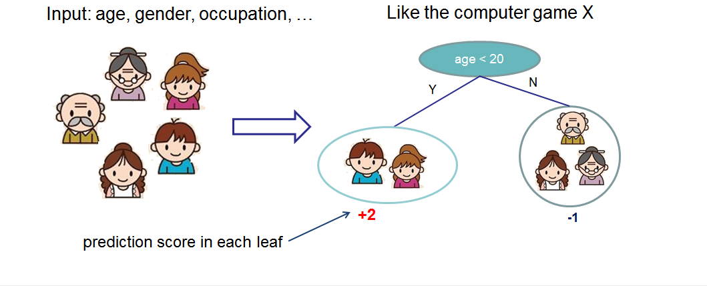
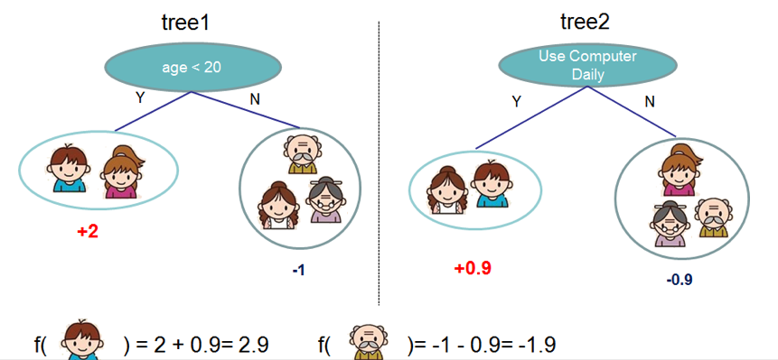
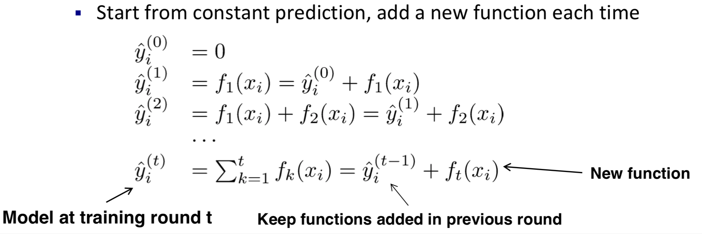
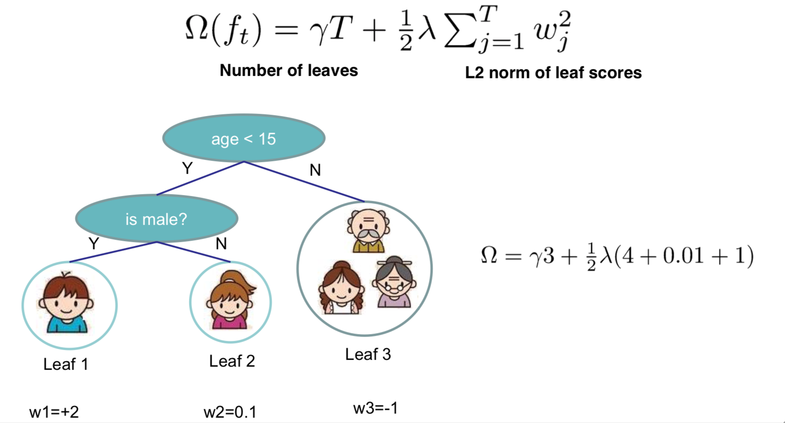

## Contents

- [1. XGBoost](#1-XGBoost)
   - [1.1 XGBoost v.s. GBDT](#11-XGBoost-v.s.-GBDT)
   - [1.2 Develop XGBoost Model](#12-Develop-XGBoost-Model)
   - [1.3 Model Complexity](#13-Model-Complexity)
- [2. Parameter and Hyper Parameter](#2-Parameter-and-Hyper-Parameter)
- [3. Implementation](#3-Implementation)
- [4. Reference](#4-Reference)

## 1. XGBoost
XGBoost，short for extreme gradient boosting. It is an extension over GBM (GBDT) with improvements such as regularization to avoid overfitting, pruning and parallelism, parallel tree boosting.

### 1.1 XGBoost v.s. GBDT
- XGBoost support parallel processing in tree splitting
- XGBoost provides regularization options to avoid overfitting.
- Traditional GBDT use decision tree as classifier, while XGBoost support multiple classifiers.
- GBDT use first derivatives to minimise loss function while XGBoost apply second-order Taylor expansion on the loss function, which is faster and more accurate.
- GBDT use all training sample in every iteration while XGBoost support random sampling like random forest
- XGBoost has a built-in routine to handle missing values
- XGBoost has Built-in Cross-Validation
- GBDT is a greedy algorithm as it stops when it encounters a negative loss in the split while XGBoost splits upto the max_depth specified and then start pruning the tree backwards and remove splits beyond which there is no positive gain.

### 1.2 Develop XGBoost Model
Take a simple example of XGBoost using CART as classifier. First, develop a CART that classifies whether someone in a family will like a computer game X. We classify the members into different leaves, and assign them the score on the corresponding leaf. A CART is a bit different from decision trees, in which the leaf only contains decision values. In CART, a real score is associated with each of the leaves, which gives us richer interpretations that go beyond classification. This also allows for a principled, unified approach to optimization.

 &nbsp;

Usually, a single tree is not strong enough to be used in practice. So in a tree ensemble model, it sums the prediction of multiple trees together.

 &nbsp;

Here is an example of a tree ensemble of two trees. The prediction scores of each individual tree are summed up to get the final score. If you look at the example, an important fact is that the two trees try to complement each other. f(boy) = 2 + 0.9 = 2.9, f(grandfather) = -1 - 0.9 = -1.9

Mathematically, we can write our **model** in the form

</a>

where 𝐾 is the number of trees, 𝑓 is a function in the functional space of all possible CARTs, which is a simple CART.

The **objective function** is:
</a> where first part is loss function and second part is regularization.

**Boosting**
- Keep developing a new tree f(x) to fit the residual predicted last time.
- After we finish the training process and obtain K trees. To predict a score of a new case, according to features of this case, each single tree will give a score at leaf code.
- The predicted value is the sum of the score in each leaf code

To learn a new tree in each step, we try to have predicted value is close to real value and optimise our objective function,
 &nbsp;

### 1.3 Model Complexity
The XGBoost model including two part in calculating complexity,
- The number of leaf node in each tree
- The regularization value of score in each leaf code, for example, L2 regulation, it is the square of score.

 &nbsp;

## 2. Parameter and Hyper Parameter
- General Parameters
   - booster: type of classifier, tree-based models or linear models
   - nthread: number of cores in the system should be entered for parallel processing
- Booster Parameters
  - eta: Similar to learning rate in GBM, so that model is more robust by shrinking the weights on each step
  - min_child_weight: minimum sum of weights of all observations required in a child
  - max_depth: maximum depth of a tree，used to control over-fitting as higher depth will allow model to learn relations very specific to a particular sample.
  - max_leaf_nodes: maximum number of terminal nodes or leaves in a tree

- Learning Task Parameters
   - objective: loss function to be minimized, such as logistic, softmax
   - eval_metric:  metric to be used for validation data, such as rmse, auc, logloss

## 3. Implementation
[XGBoost Implementation](https://github.com/AprilHe/ML-Notes/blob/master/MachineLearning/5.%20Ensemble%20/5.4%20Xgboost/Xgboost.ipynb)

## 4. Reference
1. [XGBoost: A Scalable Tree Boosting System](https://arxiv.org/abs/1603.02754)
2. [Introduction to Boosted Trees](https://homes.cs.washington.edu/~tqchen/pdf/BoostedTree.pdf)
3. [Introduction to Boosted Trees](https://xgboost.readthedocs.io/en/latest/tutorials/model.html)
