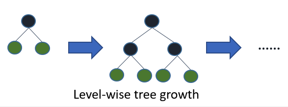
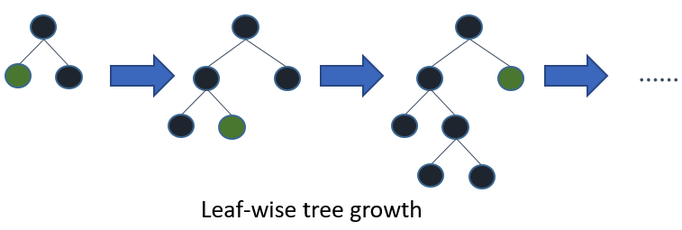

## Contents

- [1. LightGBM](#1-LightGBM)
   - [1.1 Improvements](#11-Improvements)
   - [1.2 Histogram Algorithm](#12-Histogram-Algorithm)
   - [1.3 Leaf-wise Tree Growth](#13-Leaf-Wise-Tree-Growth)
- [2. Implementation](#4-Implementation)
- [3. Reference](#5-Reference)

## 1. LightGBM
LightGBM （Light Gradient Boosting Machine) is a distributed gradient boosting framework based on decision trees. It’s histogram-based and places continuous values into discrete bins, which leads to faster training and more efficient memory usage.

### 1.1 Improvements
- Light GBM use histogram based algorithm, which gives faster training speed, Lower memory usage and higher efficiency
- Light GBM use leaf-wise split approach rather than a level-wise approach which is the main factor in achieving higher accuracy. However, it can sometimes lead to overfitting which can be avoided by setting the max_depth parameter.
- Support Categorical Feature  by partitioning its categories into 2 subsets
- Apply Gradient-based One-Side Sampling to increases the weight of the samples with small gradients (close to a local minima) when computing their contribution to the change in loss
- Exclusive Feature Bundling
- Support of parallel and GPU learning
- Ignore sparse inputs

### 1.2 Histogram Algorithm
Histogram-based methods group features into a set of bins and perform splitting on the bins instead of the features, which decrease the number of splits so that spend less time and speed up training. This is equivalent to subsampling the number of splits that the model evaluates.

To perform this method, we need to decide
- number of bins: the more bins there are, the more accurate the algorithm is, but the slower it is as well.
- how to divide the features into discrete bins
   - gives equal intervals in each bin is the most simple method but it can easily lead to unbalanced allocation of data.
   - depends on the gradient statistics.

### 1.3 Leaf Wise Tree Growth
To split the data, there are two strategies: level-wise and leaf-wise. The level-wise strategy maintains a balanced tree, it treats every decision node equally, which is not very efficient but less likely to overfit.

 &nbsp;

Leaf-wise is more efficient and flexible for large data, it splits the leaf which reduces the loss the most. So with the same number of split, Leaf-wise can decrease more error and get better accuracy. However, it is more likely to grow a deeper tree and overfit, especially for small datasets, so it is necessary to specify the max depth of the tree to avoid overfitting.

 &nbsp;

## 2. Implementation
[LightGBM Implementation](https://github.com/AprilHe/ML-Notes/blob/master/MachineLearning/5.%20Ensemble%20/5.5%20LightGBM/lightgbm.ipynb)

## 3. Reference
1. [LightGBM: A Highly Efficient Gradient Boosting Decision Tree](https://www.microsoft.com/en-us/research/wp-content/uploads/2017/11/lightgbm.pdf)
2. [LightGBM GitHub](https://github.com/Microsoft/LightGBM)
3. [LightGBM Docs](https://lightgbm.readthedocs.io/en/latest/Features.html?highlight=dart#other-features)
