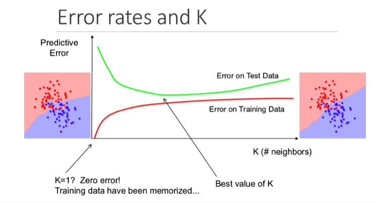

-----

## Contents
- [1. KNN](#1-KNN)
  - [1.1 Distance function](#11-Distance-function)
  - [1.2 Choosing initial K](#12-Choosing-initial-K)
- [2. K-dimension Tree](#2-K-dimension-Tree)
- [3. Implementation](#3-Implementation)
- [4. Reference](#4-Reference)

## 1. KNN
K nearest neighbours is a simple algorithm that stores all available cases and classifies new cases by a majority vote of its k neighbours. The case being assigned to the class is most common amongst its K nearest neighbours measured by a distance function.

- Initialize K as the chosen number of neighbours
- For each example in the data
   - Calculate the distance between the query example and the current example from the data.
   - Add the distance and the index of the example to an ordered collection
- Sort the ordered collection of distances and indices from smallest to largest (in ascending order) by the distances
- Pick the first K entries from the sorted collection
- Get the labels of the selected K entries
- If regression, return the mean of the K labels
- If classification, return the mode of the K labels

### 1.1 Distance function
1. **Euclidean Distance**: distance of two point in a n-dimensional space

2. **Manhattan Distance**: the distance between two data points in a grid like path. Distance d will be calculated using an absolute sum of difference between its cartesian co-ordinates as

3. **Chebyshev Distance**
Chebyshev distance (maximum metric) is a metric defined on a vector space where the distance between two vectors is the greatest of their differences along any coordinate dimension

4. **Minkowski Distance**
The Minkowski distance or Minkowski metric is a metric in a normed vector space which can be considered as a generalization of both the Euclidean distance and the Manhattan distance 

- p=1: Manhattan Distance
- p=2: Euclidean Distance
- p=∞: Chebyshev Distance

5. **Standardized Euclidean Distance**
Calculate Euclidean Distance after standardization of each feature 

6. **Mahalanobis distance**
The Mahalanobis distance is a measure of the distance between a point P and a distribution D 

7. **Bhattacharyya Distance**
Bhattacharyya distance measures the similarity of two probability distributions 

where 

8. **Hamming Distance**
Hamming distance is a metric for comparing two binary data strings. While comparing two binary strings of equal length, Hamming distance is the number of bit positions in which the two bits are different.

9. **Cosine Distance**
Cosine similarity is a measure of similarity between two non-zero vectors of an inner product space 

10. **Jaccard Distance**
The Jaccard index is a statistic used for gauging the similarity and diversity of sample sets (Intersection over Union).

11. **Pearson Distance**
In statistics, the Pearson correlation coefficient, is a statistic that measures linear correlation between two variables X and Y. It has a value between +1 and −1

### 1.2 Choosing initial K
To select the K that’s right for your data, we run the KNN algorithm several times with different values of K and choose the K that reduces the number of errors we encounter while maintaining the algorithm’s ability to accurately make predictions when it’s given data it hasn’t seen before.
Here are some things to keep in mind:
- K is small: complex model with high variance & low bias
- K is large: simple model with low variance & high bias

 &nbsp;

## 2. K-dimension Tree
[To be updated]

## 3. Implementation

[KNN]()

## 4. Reference
