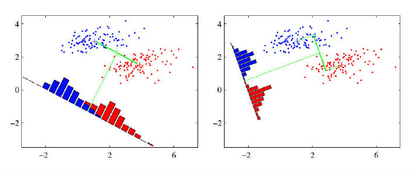
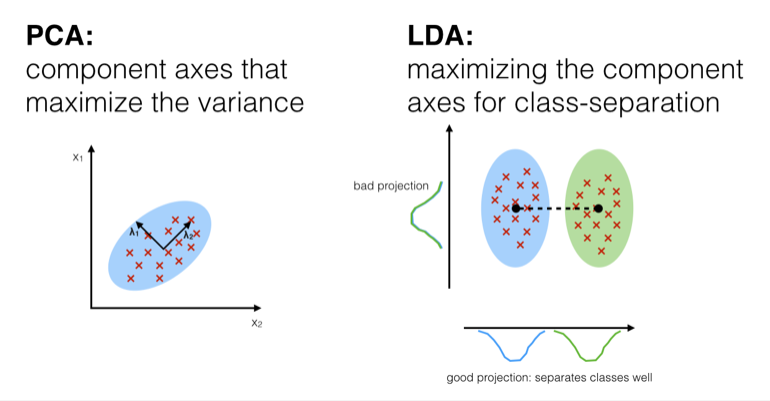

------
# Dimensionality Reduction

## Contents

- [1. Dimensionality Reduction](#1-Dimensionality-Reduction)
- [2. PCA](#2-PCA)
- [3. LDA](#3-LDA)
- [4. PCA vs. LDA](#4-PCA-vs.-LDA)
- [5. Others](#5-Others)
- [6. Reference](#6-Reference)

## 1. Dimensionality Reduction
Dimensionality reduction refers to techniques for reducing the number of input variables in training data. Here are some of the benefits of applying dimensionality reduction to a dataset:
- Space required to store the data is reduced as the number of dimensions comes down
- Less dimensions lead to less computation/training time
- Some algorithms do not perform well when we have a large dimensions. So reducing these dimensions needs to happen for the algorithm to be useful
- Eliminate multicollinearity by removing redundant features.
- visualizing data is possible for low dimensional data

Dimensionality reduction can be done in two different ways:

- Feature selection: keeping the most relevant variables from the original dataset
- Feature extraction: finding a smaller set of new variables, each being a combination of the input variables, containing basically the same information as the input variables

Commonly used methods used for dimensionality reduction:

- Principal Component Analysis (PCA)
- Linear Discriminant Analysis (LDA)

## 2. PCA
PCA is an unsupervised algorithm which helps us in extracting a new set of variables from an existing large set of variables. These newly extracted variables are called Principal Components.

- A principal component is a linear combination of the original variables
- Principal components are extracted in such a way that the first principal component explains maximum variance in the dataset
- Second principal component tries to explain the remaining variance in the dataset and is uncorrelated to the first principal component
- Third principal component tries to explain the variance which is not explained by the first two principal components and so on

It involves the following steps:

- Construct the covariance matrix of the data.
- Compute the eigenvectors of this matrix.
- Sort eigenvectors accordingly to their given value in decrease order.
- Choose first k eigenvectors and that will be the new k dimensions.
- Transform the original n-dimensional data points into k_dimensions

Dataset should be normalized before performing PCA as the transformation is dependent on scale. The features with largest scale would dominate new principal components if no scaling.

- Strengths:It's fast and simple to implement, which means you can easily test algorithms with and without PCA to compare performance. In addition, PCA offers several variations and extensions (i.e. kernel PCA, sparse PCA, etc.) to tackle specific roadblocks.
- Weaknesses: The new principal components are not interpretable. In addition, you must still manually set or tune a threshold for cumulative explained variance.

## 3. LDA
Linear discriminant analysis (LDA) also creates linear combinations of your original features. Unlike PCA, LDA doesn't maximize explained variance. Instead, it maximizes the separability between classes. Therefore, LDA is a supervised method that can only be used with labeled data.

- Compute the d-dimensional mean vectors for the different classes from the dataset.
- Compute within class Scatter matrix (Sw)
- Compute between class Scatter Matrix (Sb)
- Compute the eigenvectors and corresponding eigenvalues
- Sort the eigenvectors by decreasing eigenvalues and choose k eigenvectors with the largest eigenvalues to form a d X k dimensional matrix W.
- Reduce the Dimension

After LDA, we expect to minimal variance within class while maximal variance between different class.

</a>

- Left: the average value of two different classes has the largest distance
- Right: points of same class are close to each other, which is better than projection at left.

The LDA transformation is also dependent on scale, so data should be normalized first.

- Strengths: LDA is supervised, which can (but doesn't always) improve the predictive performance of the extracted features. Furthermore, LDA offers variations (i.e. quadratic LDA) to tackle specific roadblocks.
- Weaknesses: As with PCA, the new features are not easily interpretable, and you must still manually set or tune the number of components to keep. LDA also requires labeled data, which makes it more situational.

## 4. PCA vs. LDA
Both LDA and PCA are linear transformation techniques: LDA is a supervised whereas PCA is unsupervised – PCA ignores class labels. PCA aims to find the directions of maximal variance, LDA attempts to find a feature subspace that maximizes class separability.

</a>

## 5. Others
- Ratio of missing values
- Low variance in the column values
- High correlation between two columns
- Candidates and split columns in a random forest
- Backward feature elimination
- Forward feature construction
- Neural autoencoder
- t-distributed stochastic neighbor embedding (t-SNE)

## 6. Reference
[1. Dimensionality Reduction Techniques ](https://www.analyticsvidhya.com/blog/2018/08/dimensionality-reduction-techniques-python/)
