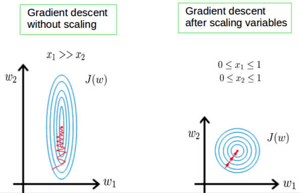

------
# Feature Engineering

## Contents

- [1. Feature Engineering](#1-Feature-Engineering)
- [2. Feature Scaling](#2-Feature-Scaling)
- [3. Categorical Feature](#3-Categorical-Feature)
- [4. Categorical Feature](#4-Categorical-Feature)
- [5. Text](#5-Text)
- [6. Others](#6-Others)

## 1. Feature Engineering
Feature engineering is the process of using domain knowledge to extract features from raw data via data mining techniques.

## 2. Feature Scaling
Feature Scaling is a technique to standardize the independent features present in the data in a fixed range. It is performed during the data pre-processing to handle highly varying magnitudes or values or units.

- Machine learning algorithms like linear regression, logistic regression, neural network, etc. that use gradient descent as an optimization technique require data to be scaled. Feature value X in the formula will affect the step size of the gradient descent. The difference in ranges of features will cause different step sizes for each feature. To ensure that the gradient descent moves smoothly towards the minima and that the steps for gradient descent are updated at the same rate for all the features, we scale the data before feeding it to the model.

- Distance algorithms like KNN, K-means, and SVM are also affected by the range of features. This is because behind the scenes they are using distances between data points to determine their similarity.

- Tree-based algorithms are fairly insensitive to the scale of the features. A decision tree is only splitting a node based on a single feature that increases the homogeneity of the node. This split on a feature is not influenced by other features.

Two most important Techniques to perform Feature Scaling:
- Min-Max Scaling: re-scales a feature value with distribution value between 0 and 1.

   

This can be useful in algorithms that do not assume any distribution of the data like K-Nearest Neighbors and Neural Networks.

- Standardization: re-scales a feature value so that it has distribution with 0 mean value and variance equals to 1.

   

Standardization is helpful in cases where the data follows a Gaussian distribution. However, this does not have to be necessarily true. Also, unlike normalization, standardization does not have a bounding range. So, even if you have outliers in your data, they will not be affected by standardization.

After Feature Scaling, it is faster to get optimal value using gradient descent.

</a>

## 3. Categorical Feature
categorical attribute represents discrete values which belong to a specific finite set of categories or classes. These discrete values can be text or numeric in nature (or even unstructured data like images!). There are two major classes of categorical data, nominal and ordinal.
- Nominal data: The categories do not have an inherent order.
- Ordinal data: The categories have an inherent order.

Encoding Method:
- Label Encoding: each label is converted into an integer value with the order information included

- One-hot Encoding Scheme: For each level of a categorical feature, we create a new variable. Each category is mapped with a binary variable containing either 0 or 1. Here, 0 represents the absence, and 1 represents the presence of that category.
- Binary Encoding: a combination of Hash encoding and one-hot encoding, the categorical feature is first converted into numerical using an ordinal encoder. Then the numbers are transformed in the binary number.

## 4. Grouping Features
1. Categorical Column Grouping
   - Preserves all the data of multiple columns, then transform the encoded column from categorical to numerical in the meantime.
   - Pivot table

2. Numerical Column Grouping
   - Numerical columns are grouped using sum and mean functions in most of the cases. Both can be preferable according to the meaning of the feature. For example, if you want to obtain ratio columns, you can use the average of binary columns. In the same example, sum function can be used to obtain the total count either.

## 5. Text
Text is an unstructured data, there are three types of commonly used method for feature engineering
- bag of words, N-gram, TF-IDF Model
- Topic Models
- word2vec

## 6. Others
1. Missing value: imputation or removal
2. Outliers
   - Outlier Detection with Standard Deviation
   - Outlier Detection with Percentiles
   - An Outlier Dilemma: Drop or Cap
3. Binning: The main motivation of binning is to make the model more robust and prevent overfitting, however, it has a cost to the performance. Histogram based method in lightgbm.
4. Log Transform: handle skewed data and decreases the effect of the outliers
