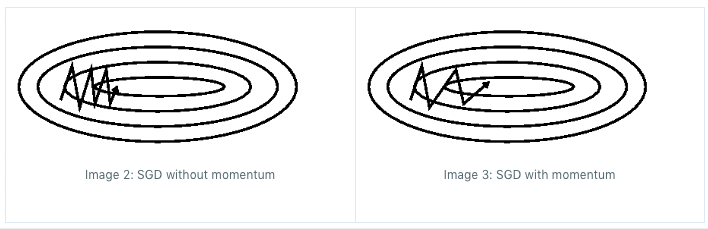

------
# Optimization

## Contents

- [1. Optimization](#1-Optimization)
- [2. Cost Function](#2-Cost-Function)
- [3. Regularization](#3-Regularization)
- [4. Convexity](#4-Convexity)
- [5. Commonly Used Optimization Methods](#5-Commonly-Used-Optimization-Methods)
- [5. Reference](#5-Reference)

## 1. Optimization
Optimization is one of the most important step in machine learning algorithms. The process is
- Define objective function: cost function + Regularization terms
- Minimize the objective function through optimization routine.

## 2. Cost Function
Cost function is used to evaluate how well specific algorithm models the given data. If predictions deviates too much from actual results, loss function would cough up a very large number. Three commonly used cost functions are introduced here:

1. Mean Square Error/Quadratic Loss/L2 Loss
   

  It measures the average of squared difference between predictions and actual observations.

2. Cross Entropy Loss/Negative Log Likelihood
Cross-entropy loss increases as the predicted probability diverges from the actual label. It is used in logistic regression.

</a>

3. Hinge Loss/Multi class SVM Loss
Hinge loss is used for maximum-margin classification, most notably for support vector machines.

4. Others
   - Mean Absolute Error/L1 Loss
   - Mean Bias Error

## 3. Regularization
Regularization is a technique used in an attempt to solve the overfitting problem in statistical models by adding a multiplier of the parameters to penalize objective function,  including L1 (Lasso), L2 (Ridge), ElasticNet.

To decide the multiplier, we can use cross-validation: you divide your training data. Train the model for a fixed value of multiplier and test it on the remaining subsets and repeat this procedure while varying multiplier. Then you select the best multiplier that minimizes loss function.

## 4. Convexity
A convex function is a continuous function whose value at the midpoint of every interval in its domain does not exceed the arithmetic mean of its values at the ends of the interval.

More generally, a function L(x) is convex on an interval [a,b] if for any two points x and y in [a,b] and any lambda where 0<lambda<1,

 

 
 

The objective function of many methods in machine learning is a weighted sum of two terms: a cost function and regularisation. In statistics terms the (log-)likelihood and (log-)prior. If both of these components are convex, then their sum is also convex. If the objective function is convex, it is guaranteed to have a unique global minimum. Non-convex functions may have several local minima, there is usually no way to test if the solution you have found is indeed the best solution.

Examples of convex optimisation problems in machine learning:

- linear regression/ Ridge regression
- sparse linear regression with L1 regularisation, such as lasso
- support vector machines
- parameter estimation in linear-Gaussian time series (Kalman filter and friends)

Examples of non-convex optimisation:
- neural networks
- maximum likelihood mixtures of Gaussians

## 5. Commonly Used Optimization Methods
1. Newton Methods

   Newton's Method is a technique that use second order derivatives to optimize loss function.

      

      
      

2. Gradient Descent

   A gradient is the slope of a function. It measures the degree of change of a variable in response to the changes of another variable. Mathematically, Gradient Descent is a convex function whose output is the partial derivative of a set of parameters of its inputs. The greater the gradient, the steeper the slope.

   **Types of Gradient Descent**:
   - Batch Gradient Descent: Parameters are updated after computing the gradient of error with respect to the entire training set, normally take long time for making a single update but smooth updates in the model parameters.
   - Stochastic Gradient Descent: Parameters are updated after computing the gradient of error with respect to a single training example. It has very noisy updates in the parameters while very fast updates.
   - Mini-batch Gradient Descent: Parameters are updated after computing the gradient of error with respect to a subset of the training set

3. SGD with momentum

   Momentum is a method that helps accelerate SGD in the relevant direction and dampens oscillations as can be seen in image below.

   

   </a>
   

   It does this by adding a fraction of the update vector of the past time step to the current update vector:

   

   
   

   

   
   

4. AdaGrad Optimization

   It adapts the learning rate to the parameters, performing smaller updates(low learning rates) for parameters associated with frequently occurring features, and larger updates (high learning rates) for parameters associated with infrequent features.

5. RMSProp Optimization

   RMSprop, or Root Mean Square Propogation, also tries to dampen the oscillations, but in a different way than momentum. RMSprop adjust learning rate automatically and it choses a different learning rate for each parameter.

6. Adam

   While momentum accelerates our search in direction of minima, RMSProp impedes our search in direction of oscillations. Adam or Adaptive Moment Optimization algorithms combines the heuristics of both Momentum and RMSProp.

7. Others
   - Adadelta
   - AdaMax
   - Nadam
   - AMSGrad
   - Quasi Newton Method

## 6. Reference
[An overview of gradient descent optimization algorithms](https://ruder.io/optimizing-gradient-descent/index.html#momentum)
