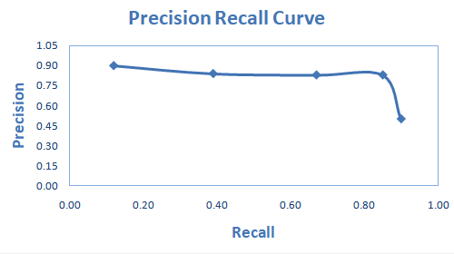
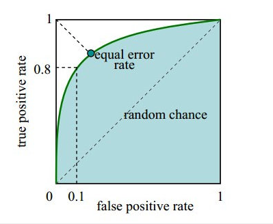
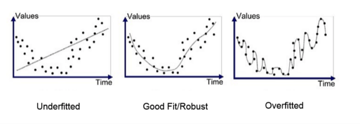

------
# Evaluation and Test

## Contents

- [1. Evaluation Methods](#1-Evaluation-Methods)
   - [1.1 Classification Model](#11-Classification-Model)
   - [1.2 Regression Model](#12-Regression-Model)
   - [1.3 Validation](#13-Validation)
   - [1.4 Hyperparameter Tuning](#14-Hyperparameter-Tuning)
   - [1.5 Overfitting and Underfitting](#15-Overfitting-and-Underfitting)
- [2. Test Methods](#2-Test-Methods)
   - [2.1 A/B Test](#21-A/B-Test)
   - [2.2 Kolmogorov-Smirnov Test](#22-Kolmogorov-Smirnov-Test)
   - [2.3 T Test](#23-T-Test)
   - [2.4 F Test](#24-F-Test)
   - [2.5 Chi Square Test](#25-Chi-Square-Test)

## 1. Evaluation Methods

### 1.1 Classification Model
**Confusion Matrix**
Confusion Matrix is a performance measurement for machine learning classification problem where output can be two or more classes.

|          | Actual Positive  | Actual Negative   |
| -------- | ------------------- | ------------------- |
| Predict  Positive| TP(True Positives)  | FP(False Positives) (Type 1 Error) |
| Predict Negative| FN(False Negatives)  (Type 2 Error) | TN(True Negatives)  |

**Accuracy** - Out of all the classes, how much we predicted correctly. It is not a good indicator for imbalanced data.

   

**Precision** - Out of all predicted positive classes, how many are actually positive.

   

**Recall** - Out of all actual positive classes, how much we predicted correctly. It should be high as possible.

   

**Precision- Recall Curve**
- x-axis: recall=TP/(TP+FN)
- y-axis: precision=TP/(TP+FP)

To draw Precision- Recall Curve:
- Calculate recall and precision values from multiple confusion matrices for different cut-offs (thresholds).
- Plot calculated values to create a precision-recall curve.

</a>

**F1-score** - helps to measure Recall and Precision at the same time.

   

**ROC Curve** - In ROC curves, the true positive rate (TPR, y-axis) is plotted against the false positive rate (FPR, x-axis). These quantities are defined as follows:
- x-axis: 1-Specificity, False positive rate，FPR，FPR=FP/(FP+TN)
- y-axis: Sensitivity, True positive rate，TPR，TPR=TP/(TP+FN))
- auc (area under curve) - 1/2 - FPR/2 +TPR/2
   - auc = 1, perfect classification Model
   - 0.5 < auc < 1, better than random guess
   - auc = 0.5, random guess
   - auc < 0.5, worse than random guess but better than it if we take opposite decision

   

   </a>
   

The ROC plot is a popular and powerful measure to evaluate binary classifiers but it has some limitations when applied to imbalanced datasets. Precision-recall plot changes depending on the ratio of positives and negatives, and it is also more informative than the ROC plot when applied to imbalanced datasets.

### 1.2 Regression Model
- **Cosine Distance**
- **Euclidean Distance**

### 1.3 Validation
1. Holdout - The data set is separated into two sets, called the training set and the testing set. The function approximator fits a function using the training set only.

2. Cross validation - a technique for validating the model performance. Split the training data into k parts. We take k-1 parts as our training set and use the “held out” part as our test set. Repeat k times differently and hold out different part every time. Finally we take the average of the k scores as our performance estimation. The variance will increase and bias will decrease if we increase the number of splits (k). On contrast, the bias will increase and variance will decrease if we decrease (k).

3. Bootstrapping - a technique that helps in many situations like validation of a predictive model performance, ensemble methods, estimation of bias and variance of the model. It works by sampling with replacement from the original data, and take the “not chosen” data points as test cases.

### 1.4 Hyperparameter Tuning
A model hyperparameter is a characteristic of a model that is external to the model and whose value cannot be estimated from data. The value of the hyperparameter has to be set before the learning process begins. For example, c in Support Vector Machines, k in k-Nearest Neighbors, the number of hidden layers in Neural Networks. The aim of hyperparameter optimization in machine learning is to find the hyperparameters of a given machine learning algorithm that return the best performance as measured on a validation set.

- Grid Search: an exhaustive search (blind search/unguided search) over a manually specified subset of the hyperparameter space. This method is a computationally expensive option but guaranteed to find the best combination in your specified grid.
- Random Search: a simple alternative and similar to the grid search method but the grid is randomly selected. This method (also blind search/unguided search) is faster at getting reasonable model but will not get the best in your grid.

- Bayesian Optimization: keep track of past evaluation results which they use to form a probabilistic model mapping hyperparameters to a probability of a score on the objective function:

### 1.5 Overfitting and Underfitting
Overfitting – High variance and low bias. The model perform well on training sample but perform bad in testing sample. Techniques to reduce overfitting :
1. Increase training data.
2. Reduce model complexity.
3. Early stopping during the training phase (have an eye over the loss over the training period as soon as loss begins to increase stop training).
4. Ridge Regularization and Lasso Regularization
5. Use dropout for neural networks to tackle overfitting.

Underfitting – High bias and low variance. The model perform well on testing sample but perform bad in training sample. Techniques to reduce underfitting :
1. Increase model complexity
2. Increase number of features, performing feature engineering
3. Remove noise from the data.
4. Increase the number of epochs or increase the duration of training to get better results.

</a>

## 2. Test Methods
### 2.1 A/B Test
A/B testing is a method for figuring out the best online promotional and marketing strategies for your business. It can be used to test everything from website copy to sales emails to search ads.

### 2.2 Kolmogorov-Smirnov Test
The Kolmogorov-Smirnov test is used to decide if a sample comes from a population with a specific distribution or if two sample follow similar empirical distribution.

**statistic**

where  is the observational sample，F(x) is another observational sample or specific distribution.

### 2.3 Z test
In a z-test, the sample is assumed to be normally distributed. A z-score is calculated with population parameters such as “population mean” and “population standard deviation” and is used to validate a hypothesis that the sample drawn belongs to the same population.

### 2.4 T Test
T-tests are statistical hypothesis tests to analyze one or two sample means. Depending on the t-test that, we can compare a sample mean to a hypothesized value, the means of two independent samples, or the difference between paired samples. It should satisify the following conditions:
- sample size <30
- samples should are independently normally distributed
- unknown mean and 2 groups have unknown variances
- limiting comparing with 2 groups

### 2.5 F Test
F test compare the variances of two normally distributed groups, determine whether the variances are equal. there is no limitation on sample size.

### 2.6 Chi Square Test
Chi-square test is used to compare categorical variables. There are two type of chi-square test
- a goodness of fit, comparing frequencies of one attribute variable to theoretical expectations.
- a test of independence, comparing if a variable is associate with another variable.(the larger the sample size, the better the fit)
